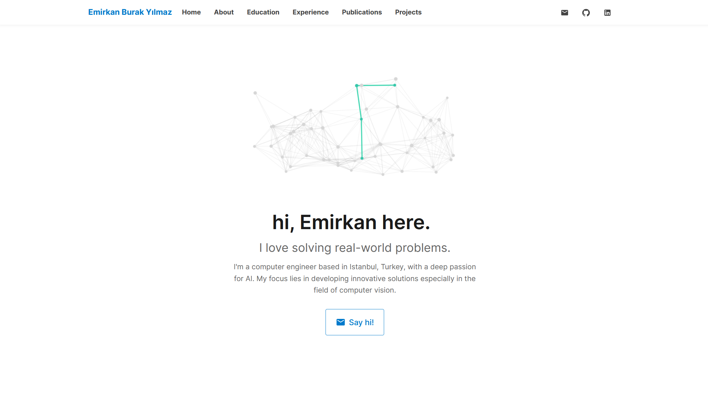

# 🧠 Emirkan Burak Yılmaz — Portfolio

Welcome to my personal portfolio website! This site showcases my background, projects, publications, and experience in the field of computer science.

🔗 **Live Demo**: [ebylmz.github.io](https://ebylmz.github.io)


<div align="center">
    
</div>


## 🛠️ Built With

- [React](https://reactjs.org/)
- [Vite](https://vitejs.dev/)
- [Material UI](https://mui.com/)
- [React Bootstrap](https://react-bootstrap.github.io/)


## 🚀 Getting Started

### Prerequisites

Make sure you have [Node.js](https://nodejs.org/) and [npm](https://www.npmjs.com/) installed.

### Installation

```bash
git clone https://github.com/ebylmz/ebylmz.github.io.git
cd ebylmz.github.io
npm install
npm run dev
Visit http://localhost:5173 in your browser.
```


### 📦 Deployment
```bash
npm run build
npm run deploy
```

Make sure your vite.config.js contains your base path:
```python
export default defineConfig({
  base: '/',
  plugins: [react()],
})
```


## 📜 License
This project is open-source and free to use. If you find it helpful or inspiring, feel free to star, fork or contribute!